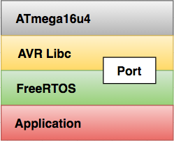

# FreeRTOS on the ATmega 16u4

The following repository is a demonstration of FreeRTOS running on the ATmega 16u4.

### Porting FreeRTOS

The FreeRTOS project provides a number of demo's and ports directly packaged with their source code. Unfortunately none of the ports were a direct match for ATmega32/16u4. However, I found [this project](https://github.com/feilipu/Arduino_FreeRTOS_Library) which did the heavy lifting of porting the low-level implementations to the common Arduino/AVR platforms. The heavy lifting that i'm referring to here includes:

* Platform specific implementations for push/pop to the Stack
* Platform specific implementation of the "system tick" in which FreeRTOS relies on to schedule

This diagram helps visualize the system and the part which must be ported.

# Demonstration Description

For the demonstration, we will implement a number of "system tasks" (described in detail below) which have hard real-time deadlines. During the execution of the program the number of completed/missed deadlines will be recorded and logged for examination.

### System tasks

The following table describes our system tasks.

| Priority | Frequency | Period | Description                                                                              |
|----------|-----------|--------|------------------------------------------------------------------------------------------|
| HIGH     | 10hz      | 100ms  | Toggle GPIO Red LED                                                                      |
| NORMAL   | 10hz      | 100ms  | Toggle GPIO Yellow LED                                                                   |
| NORMAL   | 10hz      | 100ms  | Toggle GPIO Green LED                                                                    |
| NORMAL   | 40hz      | 25ms   | Jitter On-board Yellow LED (25% chance of blinking LED for 5ms)                          |
| NORMAL   | 10hz      | 100ms  | Run [Hough Transform](https://en.wikipedia.org/wiki/Hough_transform) on a 6x6pixel image |
| LOW      | 33hz      | 30ms   | Handle Lufa (Virtual Serial) I/O                                                         |
